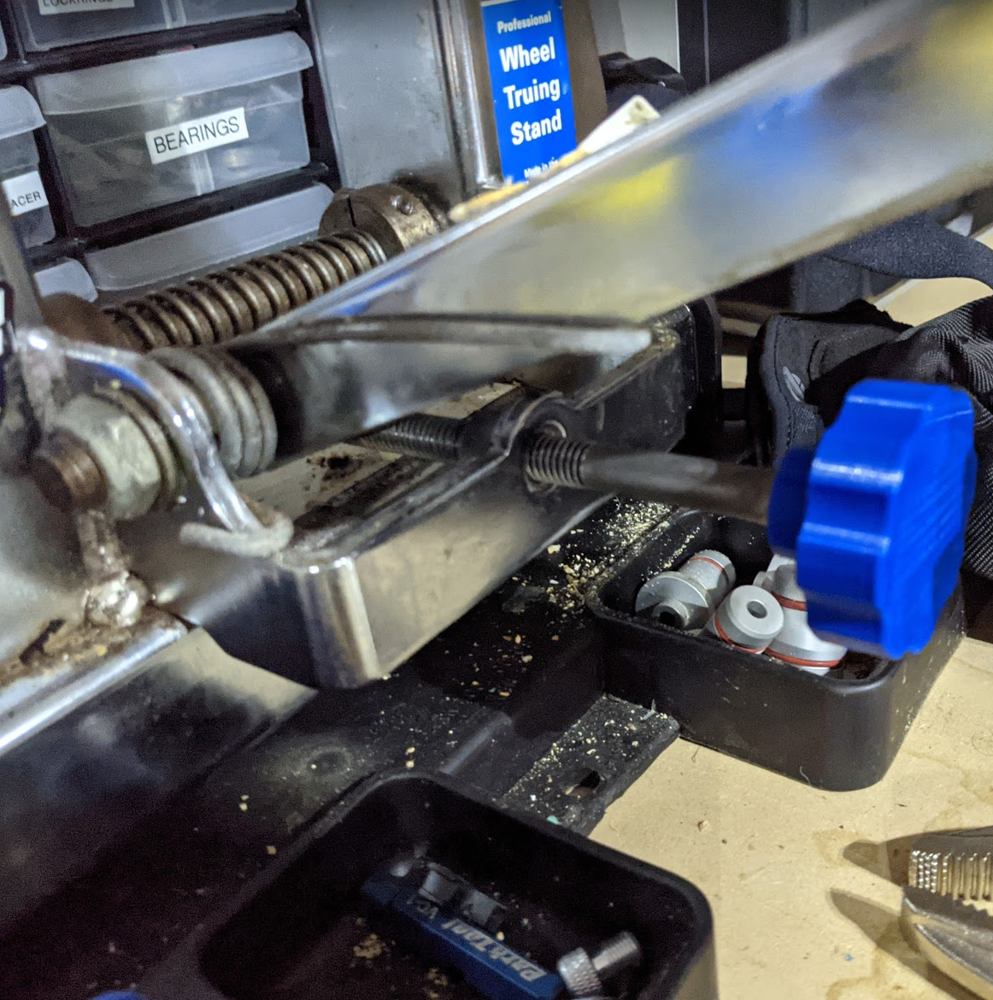
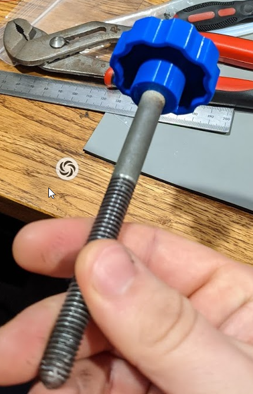
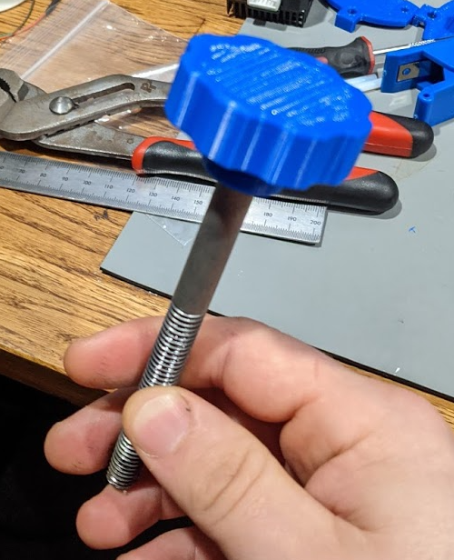

# Park tool TS-2 wheel size replacement knob

Knob broke on my old TS-2 stand.  Replacement Kit (216S) is $12, but hey I have a 3d printer!

I heated up threaded rod with a blow torch and just pressed into place.  Tried to design to be pressfit on knurled section but my printer isn't tuned and printed hole undersized, so hot fit it is!

# Changelog

2021/04/04 - Initial commit

## Design

Autocad Fusion 360 

## Slicer

Ultimaker Cura 4.8.0
- Printer: Creality CR6 SE
- Layer Height: 0.2mm
- Infill Density: 20%
- Infill Pattern: Grid
- Filament: Inland PLA+ 1.75mm Blue
- Material: PLA+
- Print Temperature: 215 degrees C

# Preview

